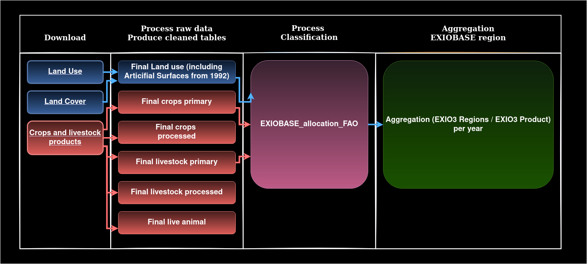
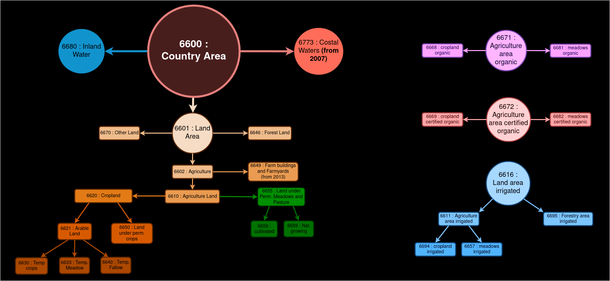
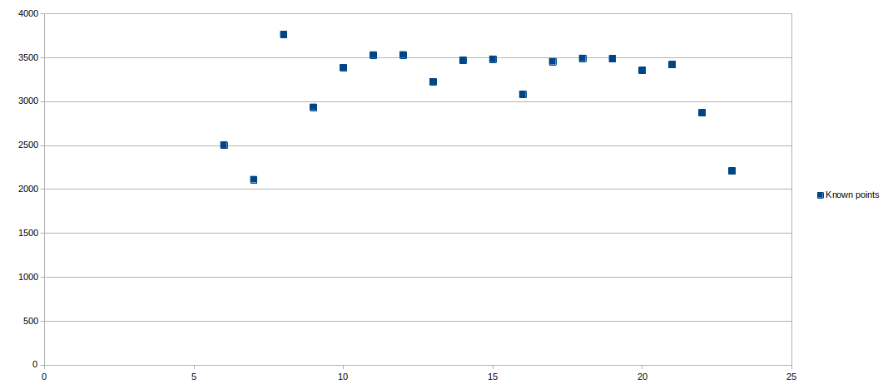
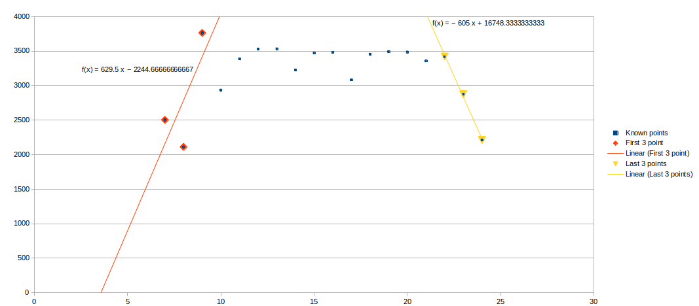
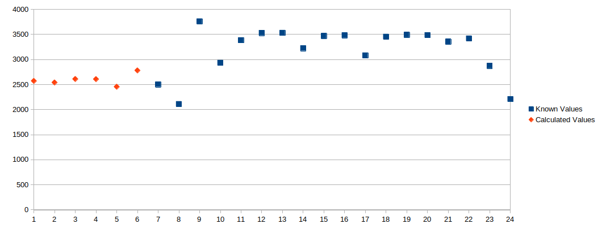
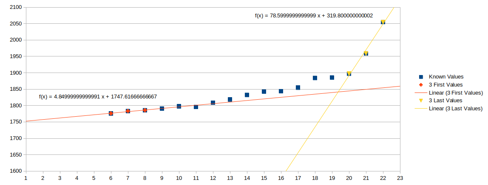
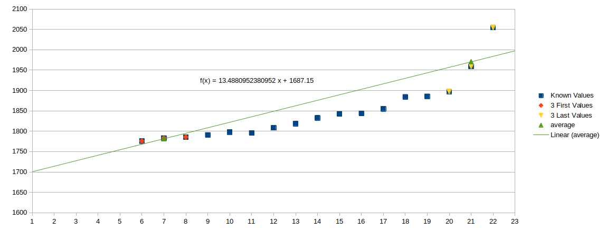

# Method #

We are aiming to determine the area of several land use type defined by [EXIOBASE](https://www.exiobase.eu/) using only data available from [FAOSTAT](http://www.fao.org/faostat/en/#data).
This can be done as a 4 steps process as illustrated by the diagram below. Each step is refering to a folder containing all the modules needed to complete the step.



The main script **run_all.py** follows these 4 steps.
DATAFOLDER is the location where one can find all files we downloaded but also all final tables we will generate through the whole process. 

```python
DATAFOLDER: Path = Path('/home/candyd/tmp/FAO')
```


# Download the data #

**main.py** 


First, we define url sources and names of the initial tables

```Python
DOWNLOAD_TASKS = dict(
    landuse=dict(
        para=dict(
            src_url="http://fenixservices.fao.org/faostat/static/bulkdownloads/Inputs_LandUse_E_All_Data.zip",
            csv_name=Path("Inputs_LandUse_E_All_Data_NOFLAG.csv"),
        ),
        processor=handlers.get_landuse,
    ),
    
    landcover=dict(
        para=dict(
            src_url="https://bulks-faostat.fao.org/production/Environment_LandCover_E_All_Data.zip",
            csv_name=Path("Environment_LandCover_E_All_Data_NOFLAG.csv"),
        ),
        processor=handlers.get_landcover,
    ),
    
    crop_livestock=dict(
        para=dict(
            src_url = "http://fenixservices.fao.org/faostat/static/bulkdownloads/Production_Crops_Livestock_E_All_Data.zip",
            csv_name = Path("Production_Crops_Livestock_E_All_Data.csv"),
        ),
        processor=handlers.get_crop_livestock,
    )
)
```

The module **handlers.py** is called in **main.py**. This module will open each table, convert the FAO country code to ISO3 codes via the package [country converter](https://github.com/IndEcol/country_converter/blob/master/country_converter/country_converter.py), remove data from FAOSTAT aggregated regions.
The unit in the Land Cover tables is converted from **'1000 ha'** to **'km<sup>2</sup>'** in order to be in adequation with the EXIOBASE units.

# Process raw data and produce clean tables #

We would like to use [FAOSTAT](http://www.fao.org/faostat/en/#data) as a unique source of data. This unique source has missing entries. We need to make assumption in order to get a complete table before to go further.
Here we will explain as a step by step process, the different assumption we made.
The diagram below summarize the different relations used in this code in order to fill empty cells.



## Dealing with missing data ##

<div class="warning" style='padding:0.1em; background-color:#E9D8FD; color:#69337A'>
<span>
<p style='margin-top:1em; text-align:center'>
<b>Important information in land account</b></p>
<p style='margin-left:1em;'>
We deal first with the land use table. To this table, we add the FAO item 6970 "Artificial surfaces" from the Land Cover table.</p>
<p style='margin-left:1em;'>
<b>Artificial surfaces</b> comes in replacement of the previous <b>infrastructure land</b> of EXIOBASE.
</p>
<p style='margin-left:1em;'>

Infrastructure land was previously defined as "The extent of infrastructure and settlement areas was estimated by combing per capita infrastructure area demand values (a function of population density and development status) derived from [Krausmann et al (2013)](https://www.pnas.org/doi/full/10.1073/pnas.1211349110) and population numbers." (see also [Supporting Information for land accounts](https://onlinelibrary.wiley.com/action/downloadSupplement?doi=10.1111%2Fjiec.12715&file=jiec12715-sup-0006-SuppMat-6.pdf) in EXIOBASE3)
</p>
</div>

!!! note

    Lorem ipsum dolor sit amet, consectetur adipiscing elit. Nulla et euismod
    nulla. Curabitur feugiat, tortor non consequat finibus, justo purus auctor
    massa, nec semper lorem quam in massa.
 


From the diagram above, we will fill the empty cells in a 2 step process.
- A simple calculation with a simple operation is implemented in the code.

For exemple, Item 6600 = Item 6601 + Item 6680 + Item 6773(from 2007)
- For each "main item", we look at the distribution of the value unto the "minor item".
For exemple, we tale the value of item 6600 for a particular year and we look at the pourcentage attributed to item 6601, item 6680 and item 6773. If the standard deviation of the pourcentage for one minor item (for all the year available) is below a certain value, we take the mean value of the pourcentage for this particulat item and we do apply this mean pourcentage in order to calculate the missing value.


The main script landuse.py reads the data and tend to fill empty cells.
Looking at the diagram above, we can notice a "pyramidal" of the land use.

The main script reads 2 yaml files : 


- [diagram.yaml](aux_data/diagram.yaml)
- [parameters.yaml](aux_data/parameters.yaml)


**diagram.yaml** contains the relations between a "major" item and its "minor"
For exemple, item 6600 (Country area) corresponds to the sum of item 6601 (Land area), item 6680 (Inland waters) and item 6773 (Coastal waters)

**parameters.yaml** contains the first and the last year of interest. It also contains information on some exeption where these years of interest are not applicable.
This is the case for some countries created after 1995 or for some FAO items which are taken into consideration at a later date.
For exemple, South Soudan (ISO3 : SSD) is created in 2011.
FAO item 6773 (Coastal waters) is registered from 2007.

The main diagram calls 4 modules : case1.py, case2.py, case3.py and case4.py
Each of these modules follows the main 2 steps : 
- Try to fill empty cells by following the simple mathematical equation : 
**major = minor1 + minor2 + minor3**
- Look at the distribution of the major item over the minor ones.
For the known values, calculate the mean and the standard deviation.
If the standard deviation for the available data is less than 5, obtain the missing minor value by doing :
**minor = mean * major /100**
After the second method, we check if the the mathematical equation :
**major = minor1 + minor2 + minor3**
is still true. If it is not the case, we adjust the values of the minor items in order to get the right result over the sum.

case1.py, case2.py case3.py and case4.py just depend on the different cases we could face :
- **case1** : the country of interest and the minor items are not in the exeptions list contained in **parameters.yaml**
- **case2** : the country of interest is not in the exeptions list but one of the minor items is
- **case3** : the country of interest is in the exeptions list but none of the minor item is
- **case4** : Both, the country of interest and one of the minor item are in the exeptions list


When the 2 main steps are performed, we carry on by doing interpolation in order to fill empty cells surrounded by non empty cells.

Finally, we do some extrapolation. The graph below represents a typical case where there are a number of missing points at the beginning of the sample. On this graph, we can see that point 1 to point 5 included are missing.



We decided to follow 2 differents directions in order to fill the empty cells.
First, we choose to select the 3 first known values (red points on the graph below) and the last three (yellow points).

We proceed to a linear regression on these 2 lots of points.
We then need to compare the slopes of the 2 linear regressions.
On the exemple below, we can see the slopes are of diferent sign.
In this case, the missing values are calculated as followed :
we calculate the average of the 3 first known values (red points).
This average is allocated to the point just before the first known value. We carry on descending from the first unknown year to the first year of interest :

```python
if  not np.sign(model.coef_) == np.sign(model2.coef_):
    for years in range(first_year-1,parameters.get("year_of_interest").get("begin")-1,-1):
        value1 =df.loc[(df['Item Code']==item)&(df['ISO3']==code),["Y" + str(years+1)]]
        value1=float(value1.to_string(index=False, header=False))
        value2 =df.loc[(df['Item Code']==item)&(df['ISO3']==code),["Y" + str(years+2)]]
        value2=float(value2.to_string(index=False, header=False))
        value3 =df.loc[(df['Item Code']==item)&(df['ISO3']==code),["Y" + str(years+3)]]
        value3=float(value3.to_string(index=False, header=False))
        average=(value1+value2+value3)/3
        df.loc[(df['Item Code']==item)&(df['ISO3']==code),["Y" + str(years)]]=average
```
Through this method, we obtain the missing points represented in red on the graph below.


We can also face a case where the 2 slopes are of the same sign : 

```python
if  np.sign(model.coef_) == np.sign(model2.coef_):

    value1 =df.loc[(df['Item Code']==item)&(df['ISO3']==code),["Y" + str(first_year)]]
    value1=float(value1.to_string(index=False, header=False))
    value2 =df.loc[(df['Item Code']==item)&(df['ISO3']==code),["Y" + str(first_year+1)]]
    value2=float(value2.to_string(index=False, header=False))
    value3 =df.loc[(df['Item Code']==item)&(df['ISO3']==code),["Y" + str(first_year+2)]]
    value3=float(value3.to_string(index=False, header=False))
                                
    value4 =df.loc[(df['Item Code']==item)&(df['ISO3']==code),["Y" + str(parameters.get("year_of_interest").get("end"))]]
    value4=float(value4.to_string(index=False, header=False))
    value5 =df.loc[(df['Item Code']==item)&(df['ISO3']==code),["Y" + str(parameters.get("year_of_interest").get("end")-1)]]
    value5=float(value5.to_string(index=False, header=False))
    value6 =df.loc[(df['Item Code']==item)&(df['ISO3']==code),["Y" + str(parameters.get("year_of_interest").get("end")-2)]]
    value6=float(value6.to_string(index=False, header=False))
                                
    average=(value1+value2+value3)/3
    average2=(value4+value5+value6)/3
    x = np.array([first_year+1, parameters.get("year_of_interest").get("end")-1]).reshape((-1, 1))
    linear = np.array([average, average2])
    model3=LinearRegression().fit(x, linear)
    for years in range(first_year-1,parameters.get("year_of_interest").get("begin")-1,-1):
        df.loc[(df['Item Code']==item)&(df['ISO3']==code),["Y" + str(years)]]=model3.coef_ * years +model3.intercept_
```    
In this case, we calculate the average of the first 3 points and the average of the last 3 points.
Knowing these 2 values, we calculate the linear regression passing these 2 points (green points and green line on the graph below). In order to determine the missing values, we simply apply the latest equation (linear regression). 


_**Remarks regarding the extrapolation's step :**
1. If the last value is 0 (based on actual data) we continue with zero.
2. If we reach zero through an extrapolation, we take the last non zero value and fill the rest of the empty cells with it._


The main script **landuse.py** is written as follow :
1. We deal first with the main diagram on the left hand side of the first picture. This means we deal with all the values going from FAO item 6600 (Country area) to items 6630 (temporary crops), item 6633 (temporary meadows) and item 6640 (Temporary fallow).
```python
#CASE1
if not a and not code in parameters.get("exeptions"):
     case1.solve(df, dfs,code,relevant_years, diagram,key,country,missing)
#CASE2
if a and code not in parameters.get("exeptions"):
    case2.solve(df, dfs,code,relevant_years, diagram,key,country,missing,year3b,year3e,year2e,year2b,year1e,year1b,a)
#CASE3
if not a and code in parameters.get("exeptions"):
    case3.solve(df, dfs,code,relevant_years, diagram,key,country,missing)      
#CASE4
if a and code in parameters.get("exeptions"):
    case4.solve(df, dfs,code,relevant_years, diagram,key,country,missing,year3b,year3e,year2e,year2b,year1e,year1b,a)
```

2. We interpolate in order to fill empty cells surrounded by non empty cells for the items composing this main diagram (the list of items is in the **items_primary.yaml** file)
```python
for code in country :
    for item in items_primary:
        if item in (df.loc[df['ISO3']==code, ["Item Code"]].values) :
            fill_cells.fill(code, item, relevant_years,df,parameters)
```

3. We make sure the mathematical relation **major = minor1 + minor2 + minor3** is valid :         
```python
for code in country :
    if not code in parameters.get("exeptions"):
        relevant_years = [make_valid_fao_year(year) for year in list(range(parameters.get("year_of_interest").get("begin"),parameters.get("year_of_interest").get("end")+1))]
    else:
        relevant_years = [make_valid_fao_year(year) for year in list(range(parameters.get("exeptions").get(code).get("begin"),parameters.get("exeptions").get(code).get("end")+1))]

    for key in diagram:
        for years in relevant_years :
            adj2.adjust(df,code,years, diagram,key,country)
```
If not, we adjust : 
```python
value_minor1= value_minor1*value_major/(value_minor1+value_minor2+value_minor3)
value_minor2= value_minor2*value_major/(value_minor1+value_minor2+value_minor3)value_minor3= value_minor3*value_major/(value_minor1+value_minor2+value_minor3)
                
df.loc[(df['ISO3']==code)&(df['Item Code']==diagram.get(key).get("minor1")),[years]]=value_minor1
df.loc[(df['ISO3']==code)&(df['Item Code']==diagram.get(key).get("minor2")),[years]]=value_minor2
df.loc[(df['ISO3']==code)&(df['Item Code']==diagram.get(key).get("minor3")),[years]]=value_minor3
```
4. We use the regression method in order to fill the empty cells at the beginning or at the end of the data sample.
```python
for code in country :
    reg.regression(code,parameters,df)
```
Folowwing this step, we check again if the mathematical relation **major = minor1 + minor2 + minor3** is still valid and adapt the values of the minor items in case this is not true.

5. After we dealt with the main diagram, we deal with the "lonely" items, the one that do not directly depend on another.
The list of these are contained in the yaml file called **unique_items.yaml**.
For these items, only the interpolation and the regression procedure are applied.

6. Finally, we deal with the small diagrams on the right hand side of the first picture. Here, we use the items listed in the files : **small_diagrams.yaml** and **items_small_diagrams.yaml**
Steps 1 to 4 are applied.


# Doing Calculation #

This concerne the module **landuse_calculation.py** in the [EXIOBASE](https://www.exiobase.eu/) folder. For the detailed split of the land use data to match the EXIOBASE sector resolution the following data sources were used:  [FAOSTAT](http://www.fao.org/faostat/en/#data). We split cropland into 21 sub-sectors based on information from FAOSTAT. Areas actually planted to crops in a given year were accounted for based on the amount of harvested area statistics from FAOSTAT’s crops domain. For this, we grouped individual crops into the EXIOBASE sector classification from [Stadler et al.](https://onlinelibrary.wiley.com/doi/full/10.1111/jiec.12715) (2018). 
Before to proceed to the different calculations, we need to convert each FAO item codes into Exiobase product code following the 
[Correspondance](Of_interest/Primary_production.csv). When the correspondance between FAO item to EXIOBASE product is done, we have to aggregate all the FAO item having the same corresponding EXIOBASE product code. The following table list the FAO items corresponding to the EXIOBASE category **Cereal grains nec** : **p01.c** :

| FAO item name | FAO item code | Subcategory       | Environmental extension | EXIOBASE product code | EXIOBASE product  |
|---------------|---------------|-------------------|-------------------------|-----------------------|-------------------|
| Barley        | 44            | Cereal grains nec | Cereal grains nec       | p01.c                 | Cereal grains nec |
| Maize         | 56            | Cereal grains nec | Cereal grains nec       | p01.c                 | Cereal grains nec |
| Popcorn       | 68            | Cereal grains nec | Cereal grains nec       | p01.c                 | Cereal grains nec |
| Rye           | 71            | Cereal grains nec | Cereal grains nec       | p01.c                 | Cereal grains nec |
| Oats          | 75            | Cereal grains nec | Cereal grains nec       | p01.c                 | Cereal grains nec |
| Millet        | 79            | Cereal grains nec | Cereal grains nec       | p01.c                 | Cereal grains nec |
| Sorghum       | 83            | Cereal grains nec | Cereal grains nec       | p01.c                 | Cereal grains nec |
| Buckwheat     | 89            | Cereal grains nec | Cereal grains nec       | p01.c                 | Cereal grains nec |
| Quinoa        | 92            | Cereal grains nec | Cereal grains nec       | p01.c                 | Cereal grains nec |
| Fonio         | 94            | Cereal grains nec | Cereal grains nec       | p01.c                 | Cereal grains nec |
| Triticale     | 97            | Cereal grains nec | Cereal grains nec       | p01.c                 | Cereal grains nec |
| Canary Seed   | 101           | Cereal grains nec | Cereal grains nec       | p01.c                 | Cereal grains nec |
| Grain, mixed  | 103           | Cereal grains nec | Cereal grains nec       | p01.c                 | Cereal grains nec |


This aggregation leads us to the total crop production in **tonnes** per EXIOBASE product : 

| ISO3 | EXIOBASE product code | EXIOBASE product        | Unit   | Y1995   | Y1996   |
|------|-----------------------|-------------------------|--------|---------|---------|
| AFG  | n.a.                  | n.a.                    | tonnes | 68000   | 68000   |
| AFG  | p01.a                 | Paddy rice              | tonnes | 390000  | 340000  |
| AFG  | p01.b                 | Wheat                   | tonnes | 2100000 | 2300000 |
| AFG  | p01.c                 | Cereal grains nec       | tonnes | 752179  | 601915  |
| AFG  | p01.d                 | Vegetables, fruit, nuts | tonnes | 2260798 | 2286268 |
| AFG  | p01.e                 | Oil seeds               | tonnes | 49705   | 48189   |
| AFG  | p01.f                 | Sugar cane, sugar beet  | tonnes | 39000   | 39000   |
| AFG  | p01.h                 | Crops nec               | tonnes | 2005    | 4205    |

or to the total harvested crop area in **ha** per EXIOBASE product :

| ISO3 | EXIOBASE product code | EXIOBASE product        | Unit | Y1995      | Y1996       |
|------|-----------------------|-------------------------|------|------------|-------------|
| AFG  | n.a.                  | n.a.                    | ha   | 60000      | 60000       |
| AFG  | p01.a                 | Paddy rice              | ha   | 170000     | 175000      |
| AFG  | p01.b                 | Wheat                   | ha   | 1927468    | 2050000     |
| AFG  | p01.c                 | Cereal grains nec       | ha   | 571982     | 466670      |
| AFG  | p01.d                 | Vegetables, fruit, nuts | ha   | 270147     | 288291      |
| AFG  | p01.e                 | Oil seeds               | ha   | 75590      | 73253       |
| AFG  | p01.f                 | Sugar cane, sugar beet  | ha   | 2200       | 2200        |
| AFG  | p01.h                 | Crops nec               | ha   | 4749.99008 | 8750.017035 |

## Seed cotton ##
Areas on which seed cotton are grown were treated differently. 
We allocated the total area partly to the oil crops category and partly to fibres as stated in the supporting information S6 of [EXIOBASE 3: Developing a Time Series of Detailed Environmentally Extended Multi-Regional Input-Output Tables](https://onlinelibrary.wiley.com/doi/full/10.1111/jiec.12715) written by Stadler _et al._ (2018)

Seed cotton > oil crops       Allocation factor : 0.63
Seed cotton > fibre)          Allocation factor : 0.37       
```Python
seed_cotton_p01e=0.63
seed_cotton_p01g=0.37      
```
```Python
for code in res :
        for year in relevant_years:
            if 'n.a.' in (df_modified.loc[df_modified['ISO3']==code, ["EXIOBASE product code"]].values) :
                
                value_seed_cotton=df_modified.loc[((df_modified['ISO3']==code) & (df_modified['EXIOBASE product code']=='n.a.')),[year]]
                seed_cotton=value_seed_cotton.to_string(index=False, header=False)
                
                cotton_to_p01e=float(seed_cotton_p01e*float(seed_cotton))
                cotton_to_p01g=float(seed_cotton_p01g*float(seed_cotton))
       
                value_p01e=df_modified.loc[((df_modified['ISO3']==code) & (df_modified['EXIOBASE product code']=='p01.e')),[year]]
                value_p01g=df_modified.loc[((df_modified['ISO3']==code) & (df_modified['EXIOBASE product code']=='p01.g')),[year]]                
                p01e=float(value_p01e.to_string(index=False, header=False))
                p01g=float(value_p01g.to_string(index=False, header=False))
                
                new_p01e=p01e+cotton_to_p01e
                new_p01g=p01g+cotton_to_p01g
         
                
                '''Replace old value p01.e and p01.g with new vales in dataframe'''
                
                df_modified.loc[((df_modified['ISO3']==code) & (df_modified['EXIOBASE product code']=='p01.e')),[year]] = new_p01e
                df_modified.loc[((df_modified['ISO3']==code) & (df_modified['EXIOBASE product code']=='p01.g')),[year]] = new_p01g  
```

## Fallowed areas ##
The fallowed area correspond to the difference between the cropland area and the harvested area :
```Python
fallowed=cropped-harvested
```

If harvested area was smaller than cropland area, the difference between the two was considered fallow area. We attributed **half of the fallow area proportionally to the different crop sectors and the other half to the primary livestock sectors**. The rationale for this choice is that FAOSTAT recently removed its information on dedicated fodder crops (e.g. maize for silage, fodder legumes) and we assume part of the “fallow” are planted to fodder crops. Also, is not uncommon for livestock to graze on fallow land in many countries. **The split between the different livestock sectors was performed based on information on the production of livestock products in a given country and a generic weighing key that reflects conversion efficiencies and roughage share in feed of for five different livestock products**. Based on literature (e.g., [Smil, 2002](https://www.sciencedirect.com/science/article/abs/pii/S014102290100504X?via%3Dihub)), the following weighing factors were applied for fallow area (here also a certain share of feed going to poultry and pigs, groups that usually do not feed on roughage, was assumed): 
- pig meat 2
- milk 1
- beef 20
- sheep and goat meat 10
- poultry 1

## Fallowed area attributed to primary livestock sectors ##
```Python
factor_beef_buffalo=20.0
factor_milk=1.0
factor_poultry=1.0
factor_pig=2.0
factor_sheep_goat=10.0 
```
Working with the Primary Livestock production means we have to deal with [Correspondance](Of_interest/List_Primary_livestock_FAO-CPA-EXIOBASE.csv) between FAO items and EXIOBASE categories. Then we have to aggregate data as a function of the EXIOBASE category. The foloowing table list the FAO items corresponding to the EXIOBASE product named **Cropland - Fodder crops-Pigs** : **p01.j**
| FAO item name        | FAO item code | EXIOBASE product code | EXIOBASE product             |
|----------------------|---------------|-----------------------|------------------------------|
| Fat, pigs            | 1037          | p01.j                 | Cropland - Fodder crops-Pigs |
| Meat, pig            | 1035          | p01.j                 | Cropland - Fodder crops-Pigs |
| Offals, pigs, edible | 1036          | p01.j                 | Cropland - Fodder crops-Pigs |

```Python
'''Values of Produced Livestock Products'''
            
p01i=df_livestock.loc[((df_livestock['ISO3']==code) & (df_livestock['EXIOBASE product code']=='p01.i')),[year]]
p01i=float(p01i.to_string(index=False, header=False))
p01j=df_livestock.loc[((df_livestock['ISO3']==code) & (df_livestock['EXIOBASE product code']=='p01.j')),[year]]
p01j=float(p01j.to_string(index=False, header=False))
p01k=df_livestock.loc[((df_livestock['ISO3']==code) & (df_livestock['EXIOBASE product code']=='p01.k')),[year]]
p01k=float(p01k.to_string(index=False, header=False))
p01l=df_livestock.loc[((df_livestock['ISO3']==code) & (df_livestock['EXIOBASE product code']=='p01.l')),[year]]
p01l=float(p01l.to_string(index=False, header=False))
p01n=df_livestock.loc[((df_livestock['ISO3']==code) & (df_livestock['EXIOBASE product code']=='p01.n')),[year]]
p01n=float(p01n.to_string(index=False, header=False))
                   
sumfodder = p01i * factor_beef_buffalo + p01j * factor_pig + p01k * factor_poultry + p01l * factor_sheep_goat + p01n * factor_milk
                    
if not sumfodder == 0:
    fodder_p01i = fodder_crop * (p01i * factor_beef_buffalo) / (p01i * factor_beef_buffalo + p01j * factor_pig + p01k * factor_poultry + p01l * factor_sheep_goat + p01n * factor_milk)
    fodder_p01j = fodder_crop * (p01j * factor_pig) / (p01i * factor_beef_buffalo + p01j * factor_pig + p01k * factor_poultry + p01l * factor_sheep_goat + p01n * factor_milk)
    fodder_p01k = fodder_crop * (p01k * factor_poultry) / (p01i * factor_beef_buffalo + p01j * factor_pig + p01k * factor_poultry + p01l * factor_sheep_goat + p01n * factor_milk)
    fodder_p01l = fodder_crop * (p01l * factor_sheep_goat) / (p01i * factor_beef_buffalo + p01j * factor_pig + p01k * factor_poultry + p01l * factor_sheep_goat + p01n * factor_milk)
    fodder_p01n = fodder_crop * (p01n * factor_milk) / (p01i * factor_beef_buffalo + p01j * factor_pig + p01k * factor_poultry + p01l * factor_sheep_goat + p01n * factor_milk)
                        
    df_fodder_crop.loc[((df_fodder_crop['ISO3']==code) & (df_fodder_crop['EXIOBASE product code']=='p01.i')),[year]] = fodder_p01i
    df_fodder_crop.loc[((df_fodder_crop['ISO3']==code) & (df_fodder_crop['EXIOBASE product code']=='p01.j')),[year]] = fodder_p01j
    df_fodder_crop.loc[((df_fodder_crop['ISO3']==code) & (df_fodder_crop['EXIOBASE product code']=='p01.k')),[year]] = fodder_p01k
    df_fodder_crop.loc[((df_fodder_crop['ISO3']==code) & (df_fodder_crop['EXIOBASE product code']=='p01.l')),[year]] = fodder_p01l
    df_fodder_crop.loc[((df_fodder_crop['ISO3']==code) & (df_fodder_crop['EXIOBASE product code']=='p01.n')),[year]] = fodder_p01n
                         
```
## Fallowed area attributed to crop sectors ##
```Python
 '''Values of Harvested area'''
                    
p01a=df_modified2.loc[((df_modified2['ISO3']==code) & (df_modified2['EXIOBASE product code']=='p01.a')),[year]]
p01a=float(p01a.to_string(index=False, header=False))
p01b=df_modified2.loc[((df_modified2['ISO3']==code) & (df_modified2['EXIOBASE product code']=='p01.b')),[year]]
p01b=float(p01b.to_string(index=False, header=False))
p01c=df_modified2.loc[((df_modified2['ISO3']==code) & (df_modified2['EXIOBASE product code']=='p01.c')),[year]]
p01c=float(p01c.to_string(index=False, header=False))
p01d=df_modified2.loc[((df_modified2['ISO3']==code) & (df_modified2['EXIOBASE product code']=='p01.d')),[year]]
p01d=float(p01d.to_string(index=False, header=False))
p01e=df_modified2.loc[((df_modified2['ISO3']==code) & (df_modified2['EXIOBASE product code']=='p01.e')),[year]]
p01e=float(p01e.to_string(index=False, header=False))
p01f=df_modified2.loc[((df_modified2['ISO3']==code) & (df_modified2['EXIOBASE product code']=='p01.f')),[year]]
p01f=float(p01f.to_string(index=False, header=False))
p01g=df_modified2.loc[((df_modified2['ISO3']==code) & (df_modified2['EXIOBASE product code']=='p01.g')),[year]]
p01g=float(p01g.to_string(index=False, header=False))
p01h=df_modified2.loc[((df_modified2['ISO3']==code) & (df_modified2['EXIOBASE product code']=='p01.h')),[year]]
p01h=float(p01h.to_string(index=False, header=False))

sum_all=p01a+p01b+p01c+p01d+p01e+p01f+p01g+p01h  if not sum_all == 0:
                  
'''Values of Fallowed crops'''
        
    fallow_p01a=fallowed_crop*p01a/sum_all
    fallow_p01b=fallowed_crop*p01b/sum_all
    fallow_p01c=fallowed_crop*p01c/sum_all
    fallow_p01d=fallowed_crop*p01d/sum_all
    fallow_p01e=fallowed_crop*p01e/sum_all
    fallow_p01f=fallowed_crop*p01f/sum_all
    fallow_p01g=fallowed_crop*p01g/sum_all
    fallow_p01h=fallowed_crop*p01h/sum_all
                           
    df_fallow_crop.loc[((df_fallow_crop['ISO3']==code) & (df_fallow_crop['EXIOBASE product code']=='p01.a')),[year]] = fallow_p01a
    df_fallow_crop.loc[((df_fallow_crop['ISO3']==code) & (df_fallow_crop['EXIOBASE product code']=='p01.b')),[year]] = fallow_p01b
    df_fallow_crop.loc[((df_fallow_crop['ISO3']==code) & (df_fallow_crop['EXIOBASE product code']=='p01.c')),[year]] = fallow_p01c
    df_fallow_crop.loc[((df_fallow_crop['ISO3']==code) & (df_fallow_crop['EXIOBASE product code']=='p01.d')),[year]] = fallow_p01d
    df_fallow_crop.loc[((df_fallow_crop['ISO3']==code) & (df_fallow_crop['EXIOBASE product code']=='p01.e')),[year]] = fallow_p01e
    df_fallow_crop.loc[((df_fallow_crop['ISO3']==code) & (df_fallow_crop['EXIOBASE product code']=='p01.f')),[year]] = fallow_p01f
    df_fallow_crop.loc[((df_fallow_crop['ISO3']==code) & (df_fallow_crop['EXIOBASE product code']=='p01.g')),[year]] = fallow_p01g
    df_fallow_crop.loc[((df_fallow_crop['ISO3']==code) & (df_fallow_crop['EXIOBASE product code']=='p01.h')),[year]] = fallow_p01h
```

**If harvested area was larger than cropland area (in case of multi-cropping) it was reduced proportionally for the different sectors to match available cropland area.**  
```Python
'''Values of Harvested area'''

p01a=df_modified2.loc[((df_modified2['ISO3']==code) & (df_modified2['EXIOBASE product code']=='p01.a')),[year]]
p01a=float(p01a.to_string(index=False, header=False))
p01b=df_modified2.loc[((df_modified2['ISO3']==code) & (df_modified2['EXIOBASE product code']=='p01.b')),[year]]
p01b=float(p01b.to_string(index=False, header=False))
p01c=df_modified2.loc[((df_modified2['ISO3']==code) & (df_modified2['EXIOBASE product code']=='p01.c')),[year]]
p01c=float(p01c.to_string(index=False, header=False))
p01d=df_modified2.loc[((df_modified2['ISO3']==code) & (df_modified2['EXIOBASE product code']=='p01.d')),[year]]
p01d=float(p01d.to_string(index=False, header=False))
p01e=df_modified2.loc[((df_modified2['ISO3']==code) & (df_modified2['EXIOBASE product code']=='p01.e')),[year]]
p01e=float(p01e.to_string(index=False, header=False))
p01f=df_modified2.loc[((df_modified2['ISO3']==code) & (df_modified2['EXIOBASE product code']=='p01.f')),[year]]
p01f=float(p01f.to_string(index=False, header=False))
p01g=df_modified2.loc[((df_modified2['ISO3']==code) & (df_modified2['EXIOBASE product code']=='p01.g')),[year]]
p01g=float(p01g.to_string(index=False, header=False))
p01h=df_modified2.loc[((df_modified2['ISO3']==code) & (df_modified2['EXIOBASE product code']=='p01.h')),[year]]
p01h=float(p01h.to_string(index=False, header=False))
sum_all=p01a+p01b+p01c+p01d+p01e+p01f+p01g+p01h  if not sum_all == 0:
                  
'''New values of Harvested area'''
                      
    new_p01a=cropped*p01a/sum_all
    new_p01b=cropped*p01b/sum_all
    new_p01c=cropped*p01c/sum_all
    new_p01d=cropped*p01d/sum_all
    new_p01e=cropped*p01e/sum_all
    new_p01f=cropped*p01f/sum_all
    new_p01g=cropped*p01g/sum_all
    new_p01h=cropped*p01h/sum_all
                           
    df_harvested_corrected.loc[((df_harvested_corrected['ISO3']==code) & (df_harvested_corrected['EXIOBASE product code']=='p01.a')),[year]] = new_p01a
    df_harvested_corrected.loc[((df_harvested_corrected['ISO3']==code) & (df_harvested_corrected['EXIOBASE product code']=='p01.b')),[year]] = new_p01b
    df_harvested_corrected.loc[((df_harvested_corrected['ISO3']==code) & (df_harvested_corrected['EXIOBASE product code']=='p01.c')),[year]] = new_p01c
    df_harvested_corrected.loc[((df_harvested_corrected['ISO3']==code) & (df_harvested_corrected['EXIOBASE product code']=='p01.d')),[year]] = new_p01d
    df_harvested_corrected.loc[((df_harvested_corrected['ISO3']==code) & (df_harvested_corrected['EXIOBASE product code']=='p01.e')),[year]] = new_p01e
    df_harvested_corrected.loc[((df_harvested_corrected['ISO3']==code) & (df_harvested_corrected['EXIOBASE product code']=='p01.f')),[year]] = new_p01f
    df_harvested_corrected.loc[((df_harvested_corrected['ISO3']==code) & (df_harvested_corrected['EXIOBASE product code']=='p01.g')),[year]] = new_p01g
    df_harvested_corrected.loc[((df_harvested_corrected['ISO3']==code) & (df_harvested_corrected['EXIOBASE product code']=='p01.h')),[year]] = new_p01h
```

## Grazing sectors ##
For the grazing sectors, only ruminant products were considered, resulting in the following weighing scheme:
- milk 1
- beef 20
- sheep and goat meat 10


The allocation of grazing lands (distinction between pasture and rangeland is not done here) corresponds to the FAOSTAT category permanent pastures and meadows. This allocation of grazing land correspond to :
- Grazing land - forests 
- Grazing land - pastures
- Grazing land - rangeland

However, an other distinction is done here.
FAOSTAT splits Permanent meadows and pastures (item 6655) unto :
- Naturally growing (item 6659)
- Cultivated (item 6656)

with :item 6655 = item 6659 + item 6656

This is also implemented in the final table. 

```Python
'''Values of Produced Livestock Products'''
            
p01i=df_livestock.loc[((df_livestock['ISO3']==code) & (df_livestock['EXIOBASE product code']=='p01.i')),[year]]
p01i=float(p01i.to_string(index=False, header=False))
p01l=df_livestock.loc[((df_livestock['ISO3']==code) & (df_livestock['EXIOBASE product code']=='p01.l')),[year]]
p01l=float(p01l.to_string(index=False, header=False))
p01n=df_livestock.loc[((df_livestock['ISO3']==code) & (df_livestock['EXIOBASE product code']=='p01.n')),[year]]
p01n=float(p01n.to_string(index=False, header=False))
                    
                    
sumgrazzing = p01i * factor_beef_buffalo + p01l * factor_sheep_goat + p01n * factor_milk

if not sumgrazzing == 0:
    grazzing_p01i = grazzing * (p01i * factor_beef_buffalo) / (sumgrazzing)
    grazzing_p01l = grazzing * (p01l * factor_sheep_goat) / (sumgrazzing)
    grazzing_p01n = grazzing * (p01n * factor_milk) / (sumgrazzing)
    
    natgrowing_p01i = natgrowing * (p01i * factor_beef_buffalo) / (sumgrazzing)
    natgrowing_p01l = natgrowing * (p01l * factor_sheep_goat) / (sumgrazzing)
    natgrowing_p01n = natgrowing * (p01n * factor_milk) / (sumgrazzing)
    
    cultivated_p01i = cultivated * (p01i * factor_beef_buffalo) / (sumgrazzing)
                        cultivated_p01l = cultivated * (p01l * factor_sheep_goat) / (sumgrazzing)
                        cultivated_p01n = cultivated * (p01n * factor_milk) / (sumgrazzing)
    
    df_grazzing.loc[((df_grazzing['ISO3']==code) & (df_grazzing['EXIOBASE product code']=='p01.i')),[year]] = grazzing_p01i
    df_grazzing.loc[((df_grazzing['ISO3']==code) & (df_grazzing['EXIOBASE product code']=='p01.l')),[year]] = grazzing_p01l
    df_grazzing.loc[((df_grazzing['ISO3']==code) & (df_grazzing['EXIOBASE product code']=='p01.n')),[year]] = grazzing_p01n
```

## Forest area ##
The forest area correspond to faostat item Forest land (6646) 

## Final Demand ##
The final demand correspond to faostat item Other land (6670)

